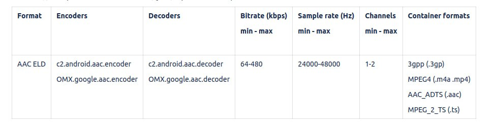

# Ровно N точек на файл и гарантия AAC ELD

Дата: 2026-08-03

Две задачи в одной правке:

1. **`--points N`** — сетку огибающей можно задать числом точек, а не только
   окном в миллисекундах или отсчётах. Задал 100 — получил ровно 100 значений
   на весь файл, ширина окна вычисляется сама.
2. **AAC ELD** — гарантировать формат во всех четырёх контейнерах, которые
   перечисляет таблица поддерживаемых форматов Android: `.3gp`, `.m4a`/`.mp4`,
   `.aac` (ADTS), `.ts` (MPEG-2 TS).

Исходное требование — строка из таблицы поддерживаемых форматов Android:


Оттуда же остальные границы: 64-480 кбит/с, 24000-48000 Гц, 1-2 канала,
кодеки `c2.android.aac.encoder` / `.decoder` и `OMX.google.aac.*`.

## 1. Контракт

### CLI

Новая опция:

```
-p, --points N      выдать ровно N точек на весь файл (окно вычисляется само)
```

* `--points`, `--ms` и `--block` **взаимоисключающие**. Любая пара — отказ с
  кодом 2 и текстом «сетку задаёт что-то одно: --points, --ms или --block».
  Это заодно убирает нынешнее молчаливое «`--ms` вытесняет `--block`», о котором
  из справки не догадаться.
* `N` от 1 до 16384. Потолок продиктован буфером подокон (см. раздел 2); за
  границей — отказ с внятным текстом, а не тихая деградация точности.
* `--limit` остаётся ортогональным: он обрезает вывод, поэтому
  `--points 100 --limit 50` даёт 50 строк.
* `--abs` при `--points` не нужен и ничего не меняет: окно всегда сворачивается
  (`peak`/`rms`/`avg`), значения и так неотрицательные. Диапазон при `--points`
  — **0..32767**, и `--header` печатает именно его.
* `--header` при `--points` печатает `points=N block=B`, где `B` — фактическая
  средняя ширина точки в отсчётах. Она известна точно: значения всё равно
  отдаются по завершении прохода, поэтому заголовок пишется тогда же и не врёт.
* Строка в stderr: `..., 100 точек по ~2826 отсчётов (~64.1 мс)`.

Если отсчётов в файле меньше, чем запрошено точек (при `N = 100` это файл
короче ~2 мс), выдаётся столько точек, сколько есть отсчётов, и в stderr уходит
сообщение об этом. Добивать вывод нулями, которых в звуке не было, нельзя:
потребитель принял бы их за тишину.

### Kotlin / JNI

Параметр `points: Int = 0` в `fromFile` / `fromUri` / `fromBytes` и в трёх
native-функциях. Взаимоисключение проверяется в Kotlin (`require` →
`IllegalArgumentException`), чтобы ошибка возникала на границе API, а не внутри
C++. `info[4]` (`blockSamples`) заполняется средней шириной точки, поэтому
`Amplitudes.pointDurationMs` продолжает работать без правок.

## 2. Ядро: `--points` в `envelope.h`

### Почему не «окно = totalFrames / N»

Истинная длина потока заранее не известна. У minimp3 `totalFrames()` точен, а у
MediaCodec это `duration × частота` из контейнера — и как раз у сырого ADTS
(`.aac`) и MPEG-TS (`.ts`), которые в этой правке становятся обязательными,
длительности часто нет вовсе (`0`) или она оценочная. Деление на оценку дало бы
99 точек вместо 100 ровно на новых форматах.

Двухпроходный вариант (посчитать длину, потом декодировать заново) точен, но
декодирует всё дважды — на длинной записи в приложении это заметная лишняя
секунда. Поэтому — один проход с подокнами.

### Накопитель

```cpp
struct Sub {                 // одно подокно, до двух каналов
    int32_t peak[2];         // максимум модуля
    int64_t absSum[2];       // сумма модулей    -> avg
    int64_t sqSum[2];        // сумма квадратов  -> rms
    int32_t count;           // отсчётов в подокне
};
```

Слияние двух подокон: `peak = max`, суммы складываются, `count` складывается.
Слияние **точное** — `avg = absSum / count` и
`rms = round(sqrt(sqSum / count))` восстанавливаются из сумм без потерь, то есть
значение точки совпадает с прямым расчётом по её отсчётам бит в бит.

Поэтому `sqSum` — целое `int64`, а не `double`: сумма квадратов PCM16 не
переполняет `int64` на потоках до полусотни часов, тогда как `double` начал бы
округлять с 2^53 и сделал бы результат зависимым от порядка слияния.
Существующий `run()` переводится на тот же `int64` — иначе два пути разойдутся в
последнем бите. На текущих фикстурах вывод при этом не меняется, что и должны
показать тесты.

### Проход

```
sub = 1                                   // ширина подокна в отсчётах
cap = min(32*N, 32768), но не меньше 2*N  // потолок буфера подокон

для каждого отсчёта:
    добавить в текущее подокно
    если оно набрало sub отсчётов          -> положить в буфер
    если буфер дорос до cap                -> слить попарно
                                              (buf[i] = buf[2i] + buf[2i+1]),
                                              sub *= 2

хвост неполного подокна -> в буфер
```

К концу прохода точное число отсчётов известно, в буфере `S` подокон. Слияние
уполовинивает буфер, а `cap >= 2N`, поэтому `S >= N` в любой момент. Точка `i` —
слияние подокон `[i*S/N, (i+1)*S/N)`. Получается ровно `N` точек, и каждая
непустая. Длительность из контейнера не нужна вообще, поэтому `duration = 0` у
ADTS и TS перестаёт быть проблемой.

Расплата — границы точек выровнены по подокну и плавают не более чем на одно
подокно, то есть на `N / S` ширины точки. `S` гуляет между `cap / 2` и `cap`,
так что в худшем случае это `2N / cap`: при `N <= 1024` — не более `1/16` (~6%),
дальше плавно ухудшается до `1/2` на предельном `N = 16384`. Память —
`cap * 48` байт, максимум ~1.5 МБ, и только на длинных файлах.

### Интерфейс

Не sink, а сразу вектор: данные всё равно буферизуются, а вызывающему (и CLI, и
JNI) нужен точный `block` до записи заголовка.

```cpp
/// Ровно p.points точек на весь поток. Возвращает число точек;
/// через totalSamples — точное число отсчётов на канал.
inline long long runPoints(Decoder &dec, const Params &p,
                           std::vector<int32_t> &values, long long *totalSamples);
```

Существующий `run()` остаётся нетронутым потоковым путём для `--ms` и `--block`:
он не должен становиться заложником буферизации.

## 3. Контейнеры AAC ELD и определение формата

Декодировать ELD отдельно не нужно: `AMediaExtractor` плюс
`AMediaCodec_createDecoderByType("audio/mp4a-latm")` берут профиль как есть.
Работа — в маршрутизации: файл сначала нюхается, и ошибка здесь отправляет ELD в
minimp3.

Две проблемы в `looksLikeMpegAudio()` (`src/decoder_open.cpp:33`):

1. **Читается всего 16 байт** заголовка файла (`decoder_open.cpp:102`), то есть
   скан sync-слова, рассчитанный на 1024 байта, для файлов работает по 16
   байтам, а для `openMemory` — по всему буферу. Пути расходятся. Чтение
   поднимается до 1024 байт.
2. **Скан принимает почти любой `0xFF`** — проверяются только версия и слой.
   Пара `0xFF 0xFF` (штатное заполнение таблиц PAT/PMT в MPEG-TS и обычный байт
   полезной нагрузки в ADTS/LATM) проходит как заголовок MPEG. С головой в 1024
   байта это выстрелит на всех трёх новых контейнерах.

Правка:

* **Отбраковка контейнеров до скана.** К имеющимся `ftyp` / `RIFF` / `OggS` /
  `fLaC` / `FORM` добавляются:
  * MPEG-TS — `0x47` на смещениях 0, 188, 376, и то же с шагом 192 (вариант с
    4-байтовой меткой времени);
  * ADTS — `0xFFFx` с нулевыми битами слоя (сейчас отсекается неявно, станет
    явным выходом);
  * LOAS/LATM — `0x56 0xEx`; в этом виде ELD чаще всего и лежит в `.aac`.
* **Проверка полей заголовка в скане.** К версии и слою добавляются индекс
  битрейта (`0000` и `1111` недопустимы) и индекс частоты (`11` недопустим).
  Этого достаточно, чтобы `0xFF 0xFF` отваливалось: индекс битрейта `1111` —
  запрещённое значение.

Цепочка из двух подряд идущих кадров (по вычисленной длине первого) сознательно
не делается: это таблицы битрейтов и полсотни строк кода, а выигрыш мал —
сниффер выбирает лишь **порядок** попыток, и ошибка стоит одной впустую
потраченной попытки, потому что `mp3dec_ex_open` на не-MP3 всё равно отказывает.

## 4. Проверка

### Юнит-тесты (`make unit`, без аудио и python)

К нынешним 13 добавляются два блока.

`runPoints` на синтетическом декодере:

* ровно `N` точек при длине, кратной и не кратной `N`;
* `N = 1`; длина ровно `N`; длина меньше `N`;
* `CH_BOTH` — два значения на точку;
* `--limit` поверх `--points`;
* сплошной `-32768` — граница диапазона;
* **точность слияния**: один и тот же поток с большим и с маленьким потолком
  буфера (то есть с разным числом слияний) обязан дать одинаковые значения для
  `peak`, `avg` и `rms`.

Сниффер на синтетических заголовках: TS с шагом 188 и 192, ADTS, LOAS, ID3,
валидный MPEG-кадр, `0xFF`-стаффинг, обрезки короче 4 байт.

### Функциональные тесты (`tests/run_tests.py`, MP3-фикстуры)

`--points` против независимого пересчёта на Python — так же, как сейчас
сверяются `--ms` и `--block`; число строк; `--header` с `points=`;
взаимоисключение опций и потолок `N` — по коду возврата и по тексту ошибки.

### Реальные файлы

В `audio/` лежат записи приложения (в git не коммитятся, каталог в `.gitignore`).
Что они дают:

* шесть целых файлов — моно, 44100 Гц, `.m4a`, **HE-AAC v1** (`AOT = 5`, SBR
  поверх ядра LC), от 39 с до 19 минут;
* «Новая запись 3 августа 2026, 14_46_21.m4a» — **оборванная запись**: 65536
  байт, `mdat` объявляет 846337 байт, `moov` отсутствует. Ровно тот случай, где
  декодер обязан отказать внятно, а не выдать молча усечённые данные.

`tests/check_eld.py` на десктопе проверяет маршрутизацию: каждый файл должен
быть опознан как «не MP3» и уйти в media-бэкенд. На десктопе это видно по
конкретной ошибке «формат не распознан как MP3, а системный декодер Android
(MediaCodec) в этой сборке недоступен» — а не по успешному разбору minimp3 и не
по чужому тексту. Битый файл проверяется отдельно: отказ, ненулевой код
возврата, отсутствие данных на stdout.

С флагом `--device` тот же скрипт гоняет файлы через `adb` на устройстве и
сверяет, что точек ровно `N`, а частота и число каналов укладываются в таблицу
(24000–48000 Гц, 1–2 канала).

### Открытый пункт

**Настоящего AAC ELD среди предоставленных файлов нет** — все шесть целых
записей это HE-AAC v1. Работа по контейнерам от профиля не зависит, и путь
декодирования у ELD тот же самый (MediaCodec), но подтвердить ELD на реальном
файле пока нечем. Нужна запись, сделанная кодировщиком `c2.android.aac.encoder`
в профиле ELD; до неё поддержка ELD остаётся проверенной только по коду и по
маршрутизации контейнеров.

## 5. Затрагиваемые файлы

| Файл | Что меняется |
|---|---|
| `src/envelope.h` | `Params.points`, `Sub`, `runPoints()`, `int64` вместо `double` в сумме квадратов |
| `src/decoder_open.cpp` | отбраковка TS/ADTS/LOAS, проверка полей заголовка, чтение 1024 байт |
| `src/decoder.h` | комментарий к `looksLikeMpegAudio` |
| `src/amplitude.cpp` | опция `--points`, взаимоисключение, заголовок и строка в stderr |
| `android/amplitude_jni.cpp` | параметр `points` в трёх native-функциях |
| `android/Amplitude.kt` | параметр `points`, `require` на взаимоисключение |
| `src/sniff.h` | новый: определение формата вынесено из `decoder_open.cpp`, чтобы тестироваться без сборки декодеров |
| `tests/check.h` | новый: общий харнесс юнит-тестов для двух файлов тестов |
| `tests/test_envelope.cpp` | тесты `runPoints` |
| `tests/test_sniff.cpp` | новый: тесты сниффера на синтетических заголовках |
| `tests/run_tests.py` | функциональные тесты `--points` |
| `tests/check_eld.py` | новый: маршрутизация на реальных файлах, режим `--device` |
| `README.md`, `INTEGRATION.md` | `--points`, AAC ELD и четыре контейнера, раздел «что проверено» |
